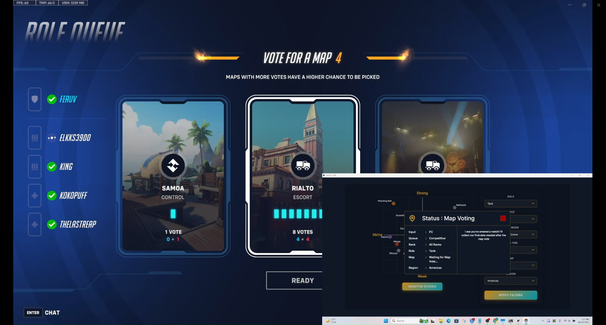
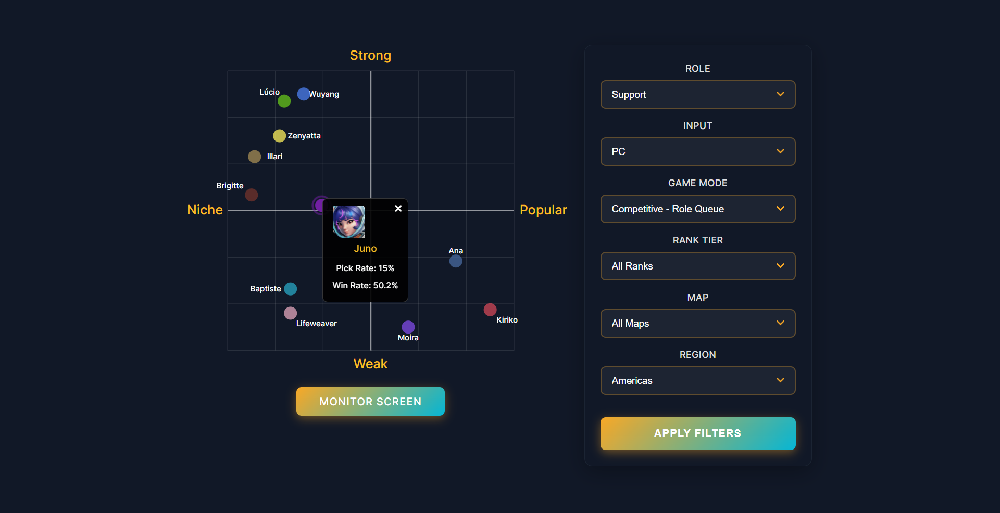
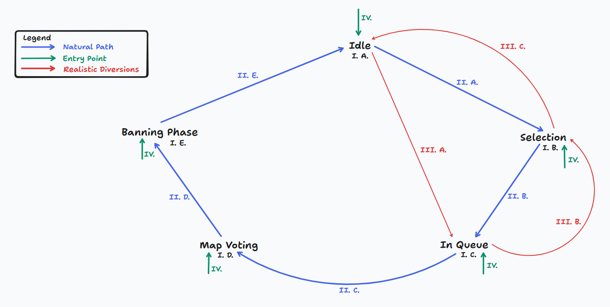

# Merlin

## Special Thanks

Just have to shoutout a couple of open source projects I could not accomplish this project without. Thank you to everyone apart of [Wails](https://v3alpha.wails.io/), they have made an amazing framework for building desktop applications with Go, it is the best framework I have ever worked with in any language. Also [kbinani's Screenshot Library](https://github.com/kbinani/screenshot), did wonders for me being able to monitor the Overwatch window and in turn made building this project 1000x easier.

## Links

[Our Main Site](https://metatrack.ing/)  
[Merlin Early Access Installation, Setup, & Demo](https://youtu.be/IR2b70qayg8?si=LDBm3qtSJjli2AD2)  
[Discord](https://discord.gg/nhpjrx4P)  

## Game State Tracking

### Status Tree & Outline

#### I. Status Checkpoints 
    A. Idle - Can signify various points within the actual game include Home Screen, End of Game 
    Screen, Settings, etc.
    B. Selection - When a Game Mode (Quick Play or Competitive) has been selected and Roles are being 
    chosen
    C. In Queue - Status of waiting to get into a match
    D. Map Voting - When the user first enters a match and everyone is voting for a map
    E. Banning Phase - (Competitive Game Mode Only) The phase in which players are choosing their 
    preferred hero and voting on what heroes to ban
#### II. Natural Path - Ideal status flow 
    A. Idle-Selection - Entering role selection
    B. Selection-In Queue - Roles selected, waiting for a match
    C. In Queue-Map Voting - Entered a match, voting for a map
    D. Map Voting-Banning Phase - Map selected, banning phase commenced
    E. Banning Phase-Idle - No in game tooling so after banning phase we return to idle. Ideal 
    situation is screen monitoring is turned off at this point
#### III. Diversions - Not connected to each necessarily like "Natural Path", exceptions to ideal status flow 
    A. Idle-In Queue - Most commonly from the of end of match requeue selection
    B. In Queue-Selection - Most commonly from cancelling of queue or changing of roles
    C. Selection-Idle - Leaves role and queue selection
#### IV. A Note on Entry Paths 
    - Every Status Checkpoint will have a way for the user to enter that status right away. I do not 
    know when a user will start monitoring their screen so it is important to keep the entry point 
    intuitive, because data can provided from them if the time has passed to capture it but what is 
    most important is I am not breaking my system and I am creating a seamless UX.
